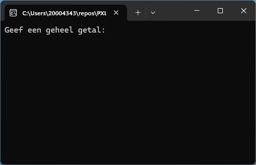
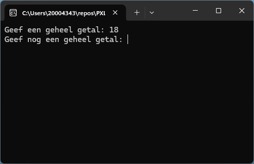
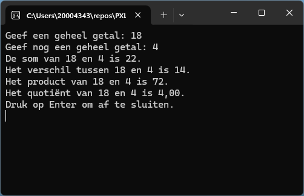

# Introductie 3 - Rekenen

- Maak een console applicatie die de gebruiker vraagt om 2 gehele getallen in te geven.
- Toon vervolgens de som, het verschil, het product en de deling van deze getallen.
- Pas wanneer de gebruiker *Enter* drukt wordt de applicatie afgesloten.

> Tip: 
> - Gebruik de `Console.Write()` methode om een tekst te tonen zonder een nieuwe regel te starten.
> - Gebruik de `Console.ReadLine()` methode om de gebruiker input te laten geven. **Deze methode geeft een *string* (tekst) terug!**
> - Gebruik de `Console.WriteLine()` methode om een tekst te tonen en een nieuwe regel te starten.
> - Gebruik de `int.Parse()` methode om een string (tekst) om te zetten naar een integer (getal).`

   